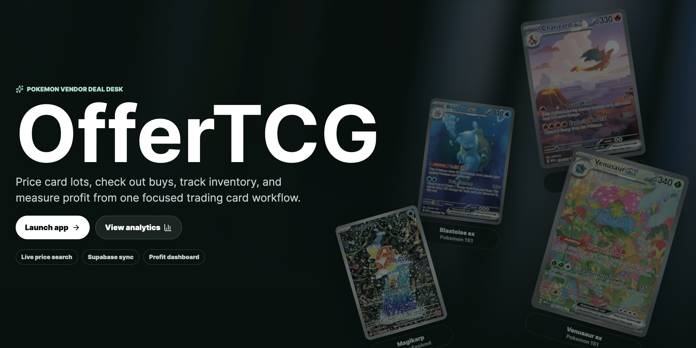
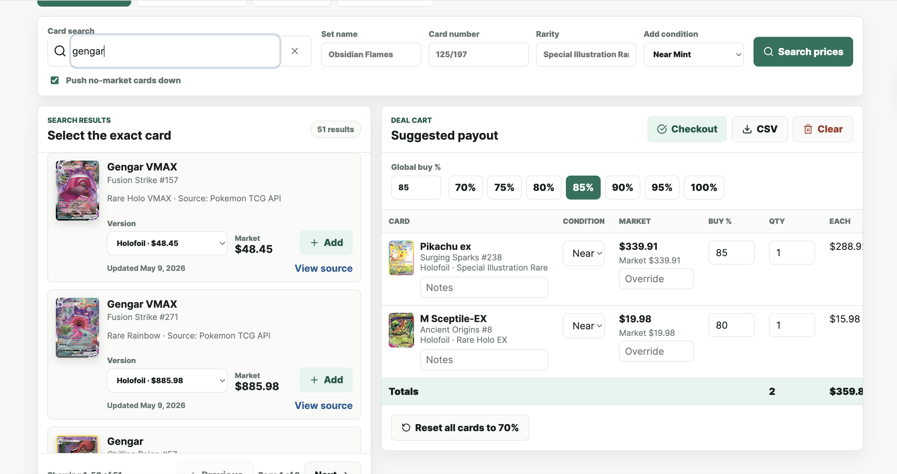
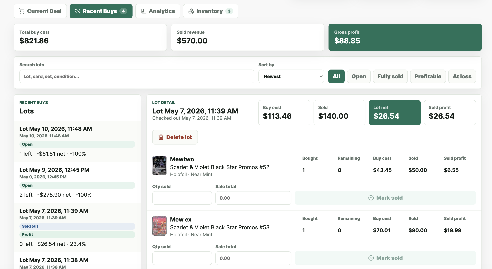
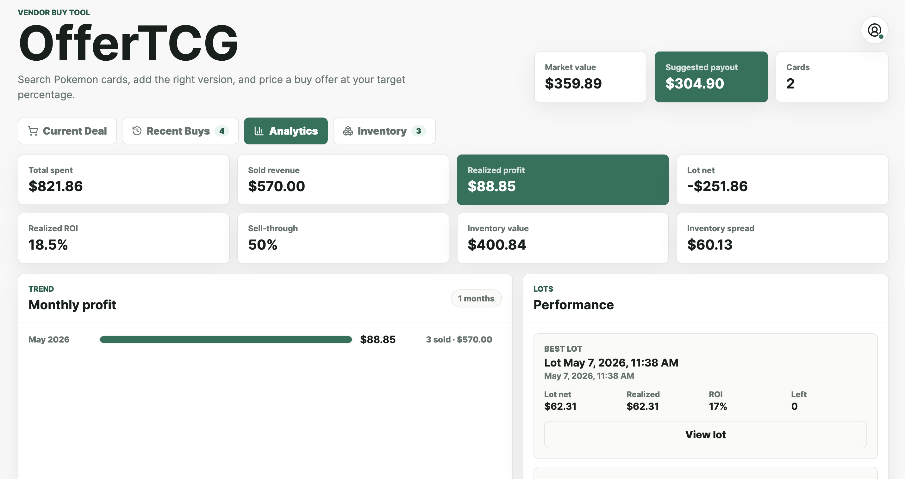
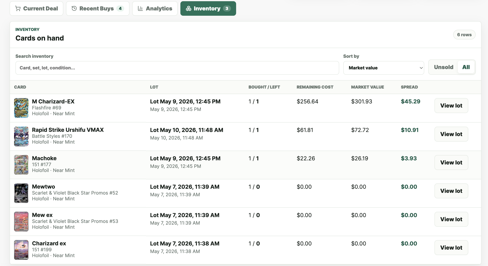

# OfferTCG

OfferTCG is a quick vendor tool for Pokemon card buy deals. Search for a card,
pick the right set/version, add it to a deal cart, and calculate a suggested
payout from a buy percentage.

## MVP Status

This repo currently contains a working MVP website with:

- Modern landing screen with an Aurora background and a rotating, animated
  Pokemon card visual library.
- Search/add flow for Pokemon cards.
- Live server-side Pokemon TCG API lookup with mock fallback.
- Deal cart totals, quantity editing, per-card buy percentages, and global quick
  percentage buttons.
- Condition selection, notes, manual market price override, clear cart, and CSV
  export.
- Supabase email/password auth with cloud persistence for signed-in users.
- Browser `localStorage` fallback and one-time import into Supabase after first
  sign-in.
- Compact profile menu for account sync controls.

## Screenshots



| Deal builder | Recent buys |
| --- | --- |
|  |  |

| Analytics dashboard | Inventory view |
| --- | --- |
|  |  |

## Stack

- Next.js App Router
- React
- TypeScript
- Tailwind CSS for shadcn-style landing background utilities
- shadcn-compatible `/components/ui` component structure
- Server route handlers for price lookup
- Supabase Auth and Postgres with RLS for account-scoped deal data
- Browser `localStorage` fallback before sign-in

## Features

- Paginated Pokemon card search by name with optional set name, card number, and
  rarity filters.
- Search results can push no-market cards below priced cards and label missing
  provider update dates as unavailable.
- Server-side price provider abstraction so API keys stay out of client code.
- Default live provider uses the Pokemon TCG API.
- Mock provider fallback when live price lookup is unavailable.
- Deal cart with market value, buy percentage, suggested buy price, quantity,
  total payout, notes, condition, manual price override, remove, clear cart, and
  CSV export.
- Checkout flow that stores recent buy lots.
- Recent buys view with partial sold-quantity tracking, gross profit by lot,
  and confirmed lot deletion.
- Recent buy history search, status filters, sort controls, and lot badges.
- Portfolio analytics dashboard with realized profit, ROI, sell-through, lot
  performance, and monthly profit bars.
- Inventory view for unsold cards across all buy lots with search, sorting, and
  lot navigation.
- Quick buy percentage buttons: 70%, 75%, 80%, 85%, 90%, 95%, and 100%.
- Cart and recent buy persistence across refreshes and login sessions.

## Setup

```bash
npm install
cp .env.example .env.local
npm run dev
```

Open `http://localhost:3000`.

To enable account sync:

1. Create a free Supabase project.
2. Run `supabase/schema.sql` in the Supabase SQL editor.
3. Copy the project URL and publishable key into `.env.local`:

```bash
NEXT_PUBLIC_SUPABASE_URL=your_project_url
NEXT_PUBLIC_SUPABASE_PUBLISHABLE_KEY=your_publishable_key
```

Without those values, the app stays in local-only mode.

The Pokemon TCG API can be used without a key at lower rate limits. For better
limits, add a server-side key:

```bash
POKEMON_TCG_API_KEY=your_key_here
PRICE_PROVIDER=pokemon-tcg
```

To force sample data:

```bash
PRICE_PROVIDER=mock
```

## Price Providers

The app does not scrape TCGplayer pages. Direct TCGplayer support should only be
added through official API access and server-side credentials. The current
provider flow is:

1. `pokemon-tcg`: calls the Pokemon TCG API from the server and maps available
   TCGplayer market prices into the app model.
2. `mock`: deterministic sample data for development and fallback behavior.
3. `tcgplayer`: placeholder for a future official TCGplayer API integration.

TCGplayer credentials must only be used through official API access and must
remain in server-side environment variables. Never expose private provider keys
in frontend code.

## Supabase Data

Signed-in users store data in four RLS-protected tables:

1. `current_deals`: active cart and global buy percentage.
2. `deal_lots`: checked-out buy lots.
3. `deal_lot_items`: card snapshots inside each lot.
4. `sale_records`: partial sold entries for lot items.

Deleting a lot removes its `deal_lots` row and cascades to the lot items and
sale records through the schema relationships.

Existing local cart/recent buy data is imported once after first sign-in, then
cleared from local storage.

## Deployment

Production is deployed on Vercel:

```text
https://offertcg.vercel.app
```

Required Vercel environment variables:

```bash
NEXT_PUBLIC_SUPABASE_URL
NEXT_PUBLIC_SUPABASE_PUBLISHABLE_KEY
PRICE_PROVIDER=pokemon-tcg
```

Optional:

```bash
POKEMON_TCG_API_KEY
```

After deployment, configure Supabase Authentication URL settings with the
production Site URL and allowed redirect URLs for the Vercel domain and
localhost development.

## Commands

```bash
npm run dev
npm run lint
npm run build
```

## Verification

The MVP was verified with:

```bash
npm run lint
npm run build
curl "http://localhost:3000/api/cards/search?q=charizard"
```

The API route returned live Pokemon TCG API data when tested locally. If live
lookup is unavailable, the app displays labeled mock data instead of scraping.

## Deal Item Model

Cart items are stored with:

- `id`
- `providerCardId`
- `variantId`
- `variantLabel`
- `name`
- `setName`
- `cardNumber`
- `rarity`
- `condition`
- `marketPrice`
- `manualMarketPrice`
- `buyPercent`
- `quantity`
- `priceSource`
- `lastUpdated`
- `notes`
- `marketPriceMissing`

Suggested buy price is calculated as:

```text
market_price * (buy_percentage / 100)
```

Prices are rounded to two decimals for display and export.
